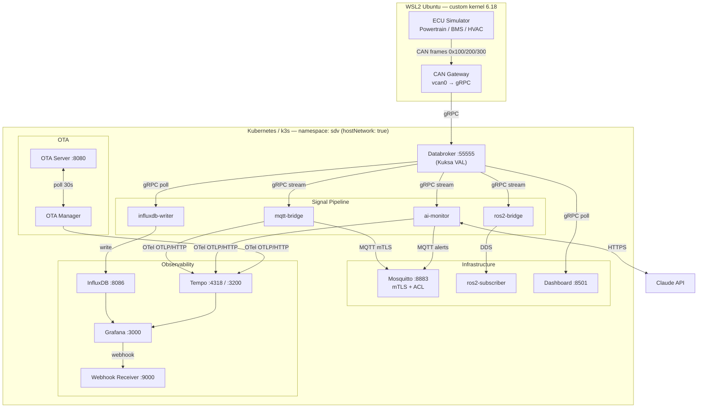

# mini-sdv-platform

> An educational simulation of a modern **Software Defined Vehicle (SDV)** platform built with open-source tools, running on Kubernetes (k3s) with full observability — distributed tracing, metrics, and alerting.

This project teaches SDV architecture by making it runnable. Every component maps to a real pattern used in production automotive software organizations. Built incrementally across 14 milestones, from a bare signal pipeline to a secured, observable, Kubernetes-managed platform.

---

## What Is a Software Defined Vehicle?

A traditional vehicle has dozens of ECUs (Electronic Control Units) communicating peer-to-peer over CAN bus. Each ECU owns its data. Adding a new feature (e.g., cloud telemetry) requires wiring into each relevant ECU individually.

A **Software Defined Vehicle** flips this model:

```
Traditional:  ECU-A ←──CAN──→ ECU-B ←──CAN──→ ECU-C
                ↓
           (tightly coupled, hard to update or extend)

SDV:          ECU-A ─CAN─┐
              ECU-B ─CAN─┼──▶  CAN Gateway  ──▶  Central Middleware  ──▶  Any App
              ECU-C ─CAN─┘      (M4)              (Databroker / VAL)
                ↓
           (decoupled — apps subscribe to signals, not ECUs)
```

All vehicle data flows through a central **Vehicle Abstraction Layer (VAL)**. Applications — the instrument cluster, a cloud backend, an AI safety agent — subscribe to named signals without knowing which ECU produces them.

---

## Current Architecture (Milestone 14)



> All services are accessible at `localhost:<port>` from Windows via WSL2 automatic port forwarding.

---

## Technology Stack

| Layer | Technology | Purpose |
|-------|-----------|---------|
| **Orchestration** | k3s (Kubernetes) | Pod lifecycle, rolling updates, Secret management |
| **Vehicle MW** | Eclipse Kuksa Databroker 0.4.4 | Vehicle Abstraction Layer, VSS signals via gRPC |
| **CAN Bus** | SocketCAN / vcan0 (Linux kernel) | Virtual CAN bus (ECU simulation) |
| **Messaging** | Eclipse Mosquitto 2.0 | MQTT broker with mTLS + ACL/RBAC |
| **AI** | Anthropic Claude Haiku | LLM-based signal anomaly detection |
| **Time-series DB** | InfluxDB 2.7 + Flux | Vehicle telemetry persistence |
| **Visualization** | Grafana 10.4.3 | Metrics dashboards + Alerting |
| **Tracing** | Grafana Tempo + OTel SDK | Distributed traces (TraceQL) |
| **OTA** | Flask + SHA-256 | UPTANE-simplified OTA update pipeline |
| **Security** | mTLS (self-signed CA) + MQTT ACL | Per-service client certs, topic-level authorization |
| **ROS2** | Humble + CycloneDDS | Autonomous driving middleware integration |

---

## Milestone Progress

| M | Title | Key Technology | Production Concept |
|---|-------|---------------|-------------------|
| **M1** ✅ | Kuksa Databroker + Dashboard | Kuksa, Streamlit, gRPC | Vehicle Abstraction Layer |
| **M2** ✅ | MQTT Bridge + Mosquitto | paho-mqtt, MQTT | V2C (Vehicle-to-Cloud) gateway |
| **M3** ✅ | ROS2 Bridge | ROS2, DDS, CycloneDDS | AD stack integration |
| **M4** ✅ | CAN Bus Simulation | SocketCAN, vcan0, custom kernel | ECU → CAN Gateway → Databroker |
| **M5** ✅ | AI Signal Monitor | Claude API, Observe-Reason-Act | LLM-based anomaly detection |
| **M6** ✅ | OTA Update Pipeline | Flask, SHA-256, UPTANE pattern | CHECK→DOWNLOAD→VERIFY→APPLY |
| **M7** ✅ | Time-Series + Grafana | InfluxDB 2.x, Flux, Grafana | Fleet telemetry persistence & visualization |
| **M8** ✅ | Fleet Simulator | Multi-vehicle, parallel threads | Multi-vehicle cloud ingestion |
| **M9** ✅ | Grafana Alerting | Alert rules, Webhook | Anomaly alert routing (PagerDuty pattern) |
| **M10** ✅ | TLS / mTLS | OpenSSL, SAN, mutual auth | Per-service client certificates |
| **M11** ✅ | MQTT ACL / RBAC | Mosquitto ACL, MQTT 5.0 | Topic-level authorization |
| **M12** ✅ | OpenTelemetry + Jaeger | OTel SDK, OTLP/HTTP | Distributed tracing — 3 pillars of observability |
| **M13** ✅ | Grafana Tempo | Tempo, TraceQL, WAL | Unified observability (metrics + traces in Grafana) |
| **M14** ✅ | Kubernetes (k3s) | k3s, Deployment, ConfigMap, Secret | Declarative orchestration, rolling updates |

---

## Prerequisites

- **Windows 11** with WSL2
- **WSL2 Ubuntu** (Ubuntu 24.04 recommended)
- **Custom WSL2 kernel 6.18** with SocketCAN support (see [M4 TRD](docs/milestone-4/TRD.md))
- **Python venv** in WSL2 (`~/sdv-venv`) with `python-can` and `kuksa-client`
- **Anthropic API key** — set `ANTHROPIC_API_KEY` in environment

> **Note on Docker**: This project uses Docker Engine directly inside WSL2 (not Docker Desktop). The custom kernel has `ip_tables.ko` and bridge networking unavailable, which prevents Docker Desktop from starting reliably. Docker Engine with `{"iptables": false, "bridge": "none"}` works correctly because all services use host networking.

---

## Quick Start

All commands run in a **WSL2 Ubuntu terminal**.

### 1. Start Docker Engine

```bash
# First time or after rebooting Windows:
echo '{"iptables": false, "bridge": "none"}' | sudo tee /etc/docker/daemon.json
sudo service docker start
docker ps   # verify: empty table = Docker is running
```

### 2. Start k3s

```bash
sudo systemctl start k3s
kubectl get nodes   # verify: laptop-xxx   Ready
```

### 3. Deploy the Platform

```bash
cd "/mnt/c/Users/takum/OneDrive/デスクトップ/Personal-Project/02_mini-sdv-platform project"

# (First time only) Install k3s and build images:
bash k8s/scripts/setup-k3s.sh
bash k8s/scripts/build-push.sh
bash k8s/scripts/init-config.sh

# Deploy all services:
export ANTHROPIC_API_KEY="sk-ant-..."
kubectl apply -f k8s/deployments/
kubectl get pods -n sdv   # all 11 pods → Running
```

### 4. Start CAN Signal Pipeline (WSL2)

```bash
# Bootstrap SocketCAN
bash scripts/setup-wsl2.sh

# Terminal A — CAN Gateway
~/sdv-venv/bin/python services/can-gateway/main.py

# Terminal B — ECU Simulator
ECU_CONFIG_PATH=/tmp/sdv-ota/ecu_config.json \
  ~/sdv-venv/bin/python services/ecu-simulator/main.py
```

### 5. Open in Windows Browser

| URL | Service |
|-----|---------|
| `http://localhost:8501` | Streamlit Dashboard |
| `http://localhost:3000` | Grafana (admin / admin) |
| `http://localhost:8086` | InfluxDB (admin / sdv-password) |

---

## Key Verification Commands

```bash
# All pods running
kubectl get pods -n sdv

# Distributed traces in Grafana Explore → Tempo
# Query: {resource.service.name="ai-monitor"}

# Live MQTT telemetry (mTLS)
mosquitto_sub -h localhost -p 8883 \
  --cafile config/certs/ca.crt \
  --cert config/certs/dashboard.crt \
  --key config/certs/dashboard.key \
  -t "sdv/vehicle-001/#" -v

# Trigger OTA update
curl -X POST http://localhost:8080/release/1.1.0

# Rolling restart (zero downtime)
kubectl rollout restart deployment/ai-monitor -n sdv
kubectl rollout status deployment/ai-monitor -n sdv

# Service logs
kubectl logs -n sdv -l app=ai-monitor --tail=20 -f
```

---

## Services (M14)

| Service | Image | Port | Description |
|---------|-------|------|-------------|
| `databroker` | kuksa-databroker:0.4.4 | 55555 | Vehicle Abstraction Layer |
| `mosquitto` | eclipse-mosquitto:2.0 | 8883 | MQTT broker (mTLS + ACL) |
| `mqtt-bridge` | local/sdv/mqtt-bridge | — | Kuksa → MQTT (V2C gateway) |
| `ai-monitor` | local/sdv/ai-monitor | — | LLM anomaly detection (Claude) |
| `ota-server` | local/sdv/ota-server | 8080 | OTA package registry |
| `ota-manager` | local/sdv/ota-manager | — | Vehicle-side OTA agent |
| `influxdb` | influxdb:2.7 | 8086 | Time-series database |
| `influxdb-writer` | local/sdv/influxdb-writer | — | Kuksa → InfluxDB writer |
| `grafana` | grafana/grafana:10.4.3 | 3000 | Dashboards + Alerting |
| `tempo` | grafana/tempo:latest | 3200/4318 | Distributed trace backend |
| `webhook-receiver` | local/sdv/webhook-receiver | 9000 | Grafana alert sink |

*ROS2 services (ros2-bridge, ros2-subscriber) and fleet-simulator run via Docker Compose.*

---

## How This Maps to Real SDV Systems

| This Project | Production SDV |
|---|---|
| vcan0 (SocketCAN) | Physical CAN bus (ISO 11898, 500 kbps) |
| ECU Simulator (Python) | Physical ECU (NXP S32, Renesas R-Car) |
| CAN Gateway (Python) | Central Gateway ECU (AUTOSAR BSW) |
| Kuksa Databroker | Central Vehicle Computer — VAL |
| Mosquitto (mTLS + ACL) | AWS IoT Core / Azure IoT Hub (TLS + policy) |
| AI Monitor + Claude API | OEM cloud AI safety monitor / in-vehicle LLM |
| OTA Manager (UPTANE pattern) | Mender / Eclipse hawkBit / OEM OTA agent |
| InfluxDB + Grafana | AWS Timestream / Grafana Cloud fleet analytics |
| Grafana Tempo + TraceQL | Jaeger / Grafana Tempo in production K8s |
| k3s (single node) | EKS / GKE / AKS (managed multi-node) |
| Self-signed CA + client certs | cert-manager + ACM / Let's Encrypt |

---

## Project Structure

```
mini-sdv-platform/
├── docker-compose.yml              ← ROS2 + fleet-simulator (host networking)
├── README.md
│
├── k8s/                            ← M14: Kubernetes manifests
│   ├── namespace.yaml
│   ├── deployments/                ← 11 Deployments + ConfigMaps
│   └── scripts/
│       ├── setup-k3s.sh            ← k3s install + registry config
│       ├── build-push.sh           ← docker build → localhost:5000
│       └── init-config.sh          ← copy configs + create Secrets
│
├── config/
│   ├── certs/                      ← TLS certs (gitignored, generated by script)
│   ├── mosquitto/
│   │   ├── mosquitto.conf          ← M10: mTLS + M11: ACL config
│   │   └── acl                     ← M11: per-CN topic permissions
│   ├── grafana/
│   │   ├── grafana.ini
│   │   └── provisioning/           ← M7: datasources, dashboards, alerting
│   ├── tempo/tempo.yaml            ← M13: Tempo OTLP config
│   ├── vss/vss_mini_covesa.json    ← VSS catalog (loaded by Databroker)
│   └── ota/                        ← M6: manifest + packages/
│
├── scripts/
│   ├── setup-wsl2.sh               ← M4: SocketCAN + Docker Engine bootstrap
│   └── generate-certs.sh           ← M10: CA + server + per-service client certs
│
├── services/
│   ├── ecu-simulator/              ← M4: CAN TX (WSL2 native)
│   ├── can-gateway/                ← M4: CAN RX → Databroker gRPC (WSL2 native)
│   ├── dashboard/                  ← M1: Streamlit live dashboard
│   ├── mqtt-bridge/                ← M2+M10+M12: Kuksa → MQTT + OTel traces
│   ├── ros2-bridge/                ← M3: Kuksa → ROS2 DDS
│   ├── ros2-subscriber/            ← M3: ROS2 verification
│   ├── ai-monitor/                 ← M5+M10+M12: LLM agent + OTel traces
│   ├── ota-server/                 ← M6: OTA package registry
│   ├── ota-manager/                ← M6+M10+M12: OTA agent + OTel traces
│   ├── influxdb-writer/            ← M7: Kuksa → InfluxDB
│   ├── fleet-simulator/            ← M8: multi-vehicle MQTT + InfluxDB
│   └── webhook-receiver/           ← M9: Grafana alert webhook sink
│
└── docs/
    ├── milestone-{1..14}/          ← PRD / FRD / TRD per milestone
    └── learning/                   ← architecture_review_m{10..14}.md (English)
```

---

## License

MIT — built for learning. Fork it, break it, extend it.
